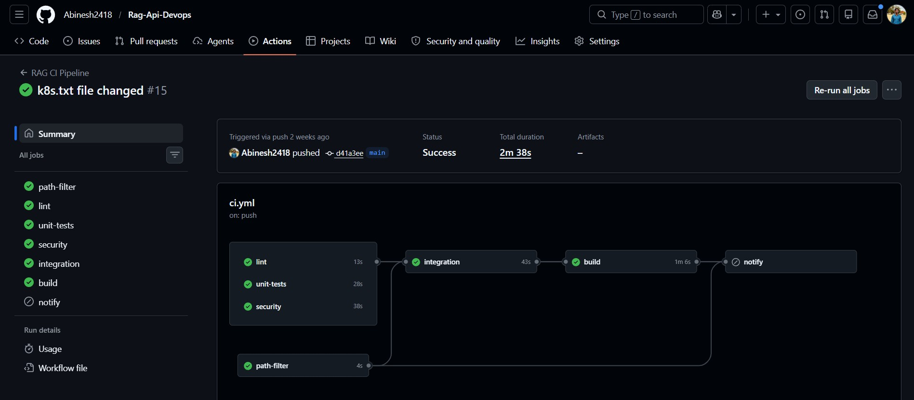
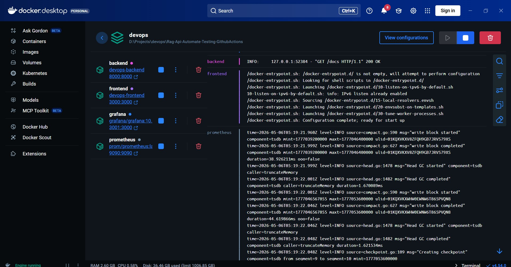
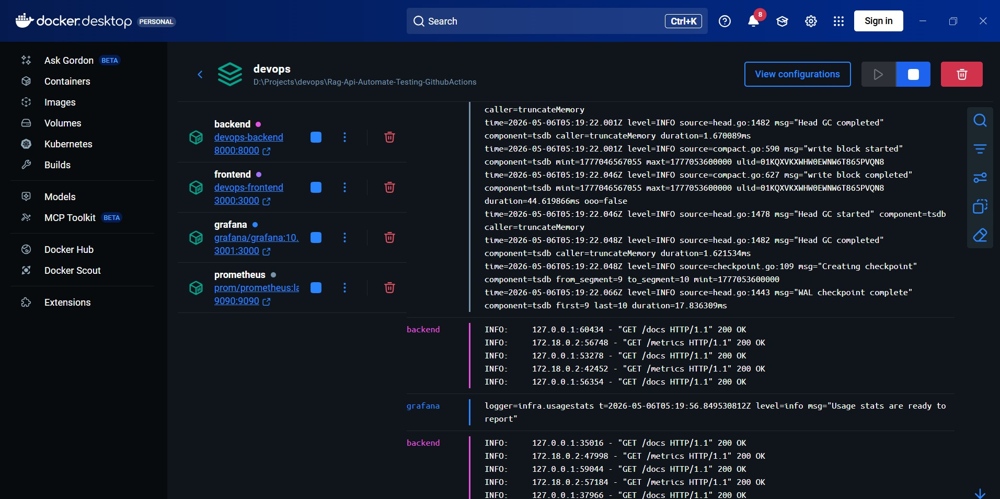
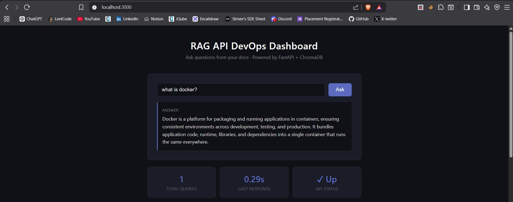
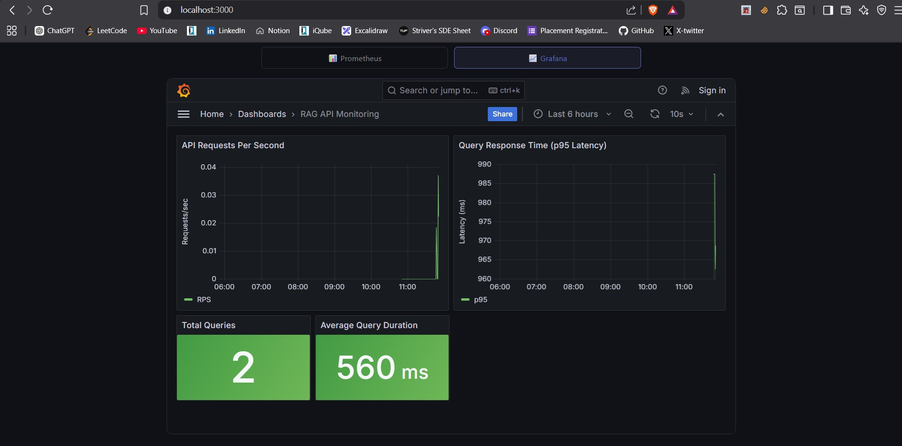
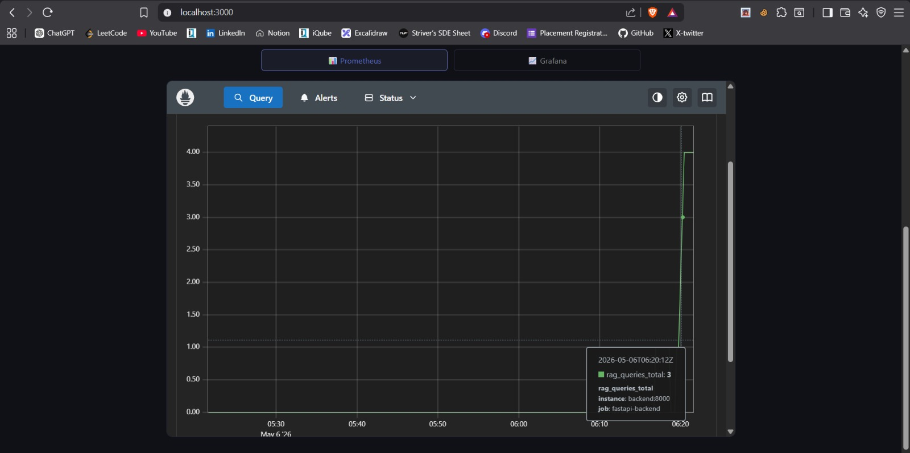
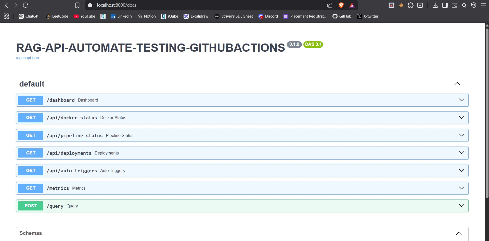

# RAG API with Automated DevOps Pipeline
### Project Report — Team 8 | Department of Computer Science | 2025–2026

---

## Table of Contents

1. [Title](#1-title)
2. [Problem Statement](#2-problem-statement)
3. [Solution](#3-solution)
4. [Tech Stack](#4-tech-stack)
5. [Screenshots](#5-screenshots)
6. [Conclusion](#6-conclusion)

---

## 1. Title

**Project Title:** RAG API with Automated DevOps Pipeline

**Domain:** DevOps

**Academic Year:** 2025 – 2026

**Team Members:**

| S.No | Name | Register No |
|:----:|------|:-----------:|
| 1 | Abisheck A M | 23BCS007 |
| 2 | Abinesh B | 23BCS006 |
| 3 | Dharun S | 23BCS034 |
| 4 | Jeevan Kumar S | 23BCS064 |

---

## 2. Problem Statement

Software teams today struggle with deploying applications the manual way. Every time a change is made to the code, someone has to manually build the project, run tests, check for errors, create a Docker image, and upload it — all by hand. This is slow, repetitive, and easy to get wrong.

Here are the specific problems we identified:

**Manual deployments take too much time.**
Every release involves the same steps done by hand — building, testing, packaging, and uploading. As the team grows, this becomes a serious bottleneck.

**Human errors creep in easily.**
When people do repetitive tasks manually, they miss steps. A wrong config, a skipped test, or an unreviewed change can break what users see in production.

**There is no way to enforce quality automatically.**
Without automation, there is nothing stopping poorly written or untested code from being deployed. Code quality and security checks depend on individual discipline, not the system.

**No visibility after deployment.**
Once the application is running, teams have no real-time view of how it is performing — how many requests are coming in, how fast it is responding, or if something is going wrong.

**AI systems go stale.**
A RAG (Retrieval-Augmented Generation) system answers questions from documents. If those documents are updated and the AI is not re-trained, users get outdated answers. Doing this by hand is unreliable.

---

## 3. Solution

We solved these problems by building a system where everything is automated — from the moment a developer pushes code, all the way to a Docker image being ready to deploy.

### An AI-Powered Question Answering System (RAG)

We built a web application where anyone can type a question and get an intelligent answer. The system searches through a set of documents stored in ChromaDB (a vector database) and passes the most relevant content to an AI language model (Groq — llama-3.1-8b-instant), which then generates a clear, grounded answer.

Users do not need to search through documents manually — they just ask a question and get an answer instantly.

### A Fully Automated CI/CD Pipeline

We connected the project to GitHub Actions, which watches for any code push to the repository. The moment code is pushed, the pipeline automatically does all of the following without any human involvement:

- Checks the code for formatting and style issues using **Ruff**
- Runs all unit tests and verifies that at least 80% of the code is covered using **pytest**
- Scans all installed packages for known security vulnerabilities using **pip-audit**
- Runs an end-to-end integration test of the live API in mock mode — no GPU needed
- Builds Docker images for both the backend and frontend
- Pushes those images to GitHub Container Registry (GHCR) with proper version tags

### One-Command Startup

The entire system — the AI backend, the web frontend, the vector database, and the monitoring tools — starts with a single command:

```bash
docker compose up --build
```

Five containers start automatically in the correct order with health checks. No manual service startup or configuration is needed.

### Live Monitoring

Prometheus automatically collects performance metrics from the API every 15 seconds. Grafana turns those metrics into live dashboards showing query counts, response times, and system health — with no manual setup required.

---

## 4. Tech Stack

Below are all the tools and technologies we used and why we chose each one.

| What It Does | Tool Used | Why We Used It |
|---|---|---|
| Backend API | FastAPI (Python 3.11) | Fast, modern Python framework with automatic API documentation |
| Reverse Proxy | Nginx (Alpine) | Routes web traffic to the right service and serves the frontend |
| Vector Database | ChromaDB | Stores document embeddings and retrieves the most relevant ones |
| AI / Language Model | Groq (llama-3.1-8b-instant) | Cloud LLM API for fast, accurate answer generation |
| Containerization | Docker + Docker Compose | Packages each service in isolation and runs them all together |
| CI/CD Automation | GitHub Actions | Runs the full pipeline automatically on every code push |
| Metrics Collection | Prometheus | Continuously scrapes the API for performance data |
| Monitoring Dashboard | Grafana (v10.4.3) | Displays live charts and dashboards from Prometheus data |
| Code Quality | Ruff | Lints and formats Python code — fast and strict |
| Testing | pytest + pytest-cov | Runs tests and measures how much code is actually tested |
| Security Scanning | pip-audit | Checks all Python packages against known vulnerability databases |
| Image Storage | GHCR | Stores the built Docker images and makes them available to deploy |

### Knowledge Base Documents

The RAG system answers questions based on these documents stored in the `docs/` folder:

| File | What It Contains |
|---|---|
| `Devops.txt` | Core DevOps concepts and how RAG fits in |
| `k8s.txt` | Kubernetes architecture and key concepts |
| `nextwork.txt` | NextWork platform information |
| `CI_AND_TESTING.md` | CI/CD pipelines and automated testing practices |

---

## 5. Screenshots

### GitHub Actions — CI/CD Pipeline Success

The pipeline ran successfully on a push to the `main` branch. All jobs — path-filter, lint, unit-tests, security, integration, and build — completed with green status. Total run time was **2 minutes 38 seconds**.



---

### Docker Containers — All Services Running

All five containers started successfully via Docker Desktop. The backend (port 8000), frontend (port 3000), Grafana (port 3001), and Prometheus (port 9090) are all running and healthy. The logs confirm the backend is responding to HTTP requests with `200 OK`.



---

### Docker Container Logs — Live HTTP Traffic

The container logs show real-time HTTP traffic flowing through the system. The backend is receiving GET requests to `/docs` and `/metrics`, and Grafana is reporting its usage stats — confirming all services are communicating correctly over the Docker network.



---

### Frontend Web Interface — RAG Query in Action

The web dashboard at `localhost:3000` shows the RAG system in action. The query **"what is docker?"** was asked and the AI returned a clear, accurate answer in **0.29 seconds**. The stats at the bottom show: 1 total query, 0.29s last response time, and API status as **Up**.



---

### Grafana Dashboard — Live API Monitoring

The Grafana dashboard (RAG API Monitoring) shows real-time metrics collected from the backend. The panels display API requests per second, query response time (p95 latency), total queries processed (**2**), and average query duration (**560 ms**).



---

### Prometheus — Metrics Graph

The Prometheus metrics explorer shows the `rag_queries_total` metric reaching a value of **3**, scraped from `backend:8000` under the job `fastapi-backend`. This confirms that Prometheus is successfully collecting data from the running API.



---

### FastAPI — API Documentation (Swagger UI)

The FastAPI Swagger documentation at `localhost:8000/docs` shows all available API endpoints under the updated project name **RAG-API-AUTOMATE-TESTING-GITHUBACTIONS**. The endpoints include `/dashboard`, `/api/docker-status`, `/api/pipeline-status`, `/api/deployments`, `/api/auto-triggers`, `/metrics`, and `POST /query`.



---

## 6. Conclusion

This project started from a simple observation — too much of what developers do day to day is repetitive, manual, and easy to get wrong. We set out to automate it, and we did.

By combining GitHub Actions, Docker, Prometheus, Grafana, and a RAG AI system, we built a pipeline where a developer writes code, pushes it, and the system handles everything else. Code quality is checked, tests are run, security is scanned, an image is built, and monitoring is live — all automatically, in under a few minutes.

### What We Achieved

- A working RAG question-answering system that searches documents and generates answers using Groq LLM
- A fully automated CI/CD pipeline with six stages: path-filter, lint, unit-tests, security, integration, and Docker build — completing in 2m 38s
- A five-container Docker stack that starts with one command and includes live monitoring from day one
- Test coverage enforced at a minimum of 80% and security checked on every single commit
- Docker images automatically pushed to GHCR with version tags for full traceability
- Real-time Grafana dashboards showing query rates, p95 latency, and average response time (560ms)
- Prometheus successfully scraping live metrics from the backend every 15 seconds

### What We Learned

- How to write GitHub Actions workflows with multiple stages and conditional execution
- Why AI systems need a mock mode to be testable in CI without expensive cloud infrastructure
- How Docker containers on a private network communicate with each other using service names
- How Prometheus and Grafana work together to provide monitoring without any manual setup
- That good DevOps systems enforce standards automatically — they do not rely on people to remember

### Future Plans

| What We Would Add Next | Why It Matters |
|---|---|
| Kubernetes | Auto-scaling, self-healing, and zero-downtime updates |
| Full auto-deployment | Containers deployed to the server automatically after a successful build |
| Multiple LLM support | Switch between Groq, Ollama, or OpenAI using a config file |
| GitOps with ArgoCD | Infrastructure managed entirely through Git |
| Live document ingestion | Add documents to the knowledge base without restarting the system |
| Alert routing | Grafana alerts sent to Slack or email when something goes wrong |

---

*Report prepared by Team 8 | Department of Computer Science | 2025–2026*
